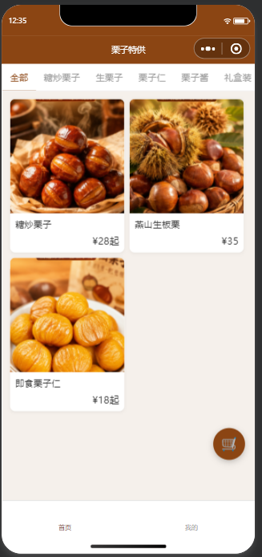
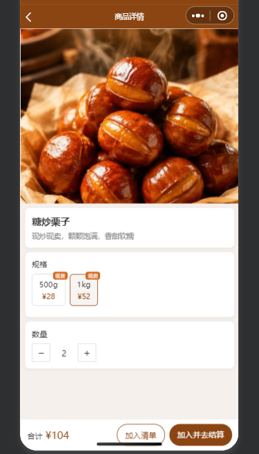
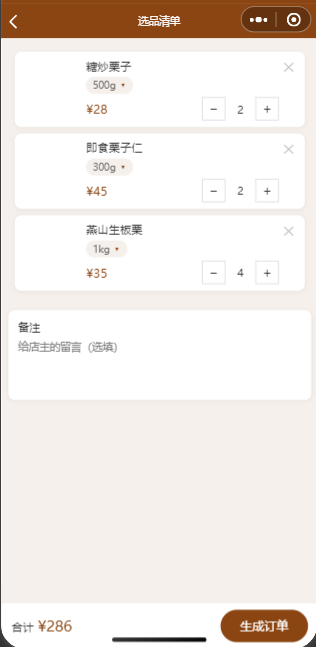
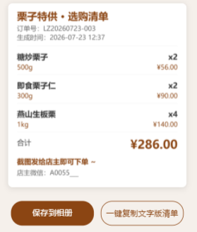

# 栗子特供 · 微信云开发电商小程序模板

> 一个基于 **微信云开发（Cloud Base）** 的微信**原生**小程序电商模板：商品展示、分类筛选、下单、店主后台一体化，**无需自建服务器**，开箱即用，可快速改造成任意品类的线上小店。

[](LICENSE)
[](https://github.com/hudejintou/lizitegong/stargazers)
[](https://github.com/hudejintou/lizitegong/network)
[](https://developers.weixin.qq.com/miniprogram/dev/framework/)
[](https://developers.weixin.qq.com/miniprogram/dev/wxcloud/)

[中文](#中文) ｜ [English](#english)

---

## 这是什么（项目定位）

这是一个 **B2C 轻量电商小程序模板**，采用微信原生开发（**不依赖 Taro / uni-app 等框架**），后端直接使用**微信云开发**（云数据库 + 云函数）。它演示了一个小店线上化的完整闭环：

> 商品橱窗浏览 → 分类筛选 → 商品详情 → 本地清单（购物车） → 下单 → 店主后台管理

项目代码简洁、注释清晰，既是**可运行的成品**，也是**学习微信云开发 / 小程序前后端一体开发**的入门示例。

## 适用场景 / 可复用领域

虽然示例店是「栗子特供」，但模板本身与品类无关，可复用于任何「**展示商品 + 收订 / 下单**」的场景，例如：

- 🥬 **农特产 / 生鲜果蔬**线上店
- 🍰 **零食 / 烘焙 / 饮品**小铺
- 🎨 **手作 / 文创 / 周边**贩售
- 🏘 **社区团购 / 邻里拼团**
- 🍜 **餐饮菜单点单 / 预订**
- 🏫 **校园 / 企业内部**物资采购
- 🏷 **品牌样品展示、活动物料预订**

只需替换 `products` 集合中的商品数据与店铺 `config`，即可上线一个属于你自己的小程序。

## 功能特性

- 🛒 **首页商品橱窗**：两列卡片布局，6 个分类标签筛选，下拉刷新，空状态提示
- 🔍 **商品详情页**：多规格展示、图片预览
- 📋 **本地清单（购物车）**：基于 `wx.storage`，右下角悬浮按钮带数量角标
- 📦 **下单**：云函数后端重新核算金额，生成订单号，写入 `orders` 集合
- 👤 **我的 / 店铺微信**：读取 `config` 集合展示店主联系方式
- 🛠 **店主后台**：商品增删改，权限基于 `admins` 集合中的 OPENID 白名单

## 截图预览

| 首页商品橱窗 | 商品详情 |
|---|---|
|  |  |

| 选品清单 | 订单卡片 |
|---|---|
|  |  |

## 技术架构

```
lizi/
├── miniprogram/        # 小程序前端（原生）
│   ├── pages/          # 页面：index / product-detail / cart / order-card / my / admin/product-manage
│   ├── components/     # 自定义组件：product-card
│   ├── utils/          # cloud.js(云函数封装) / cart-storage.js / canvas-order.js / image-map.js
│   ├── app.js / app.json / app.wxss
│   └── sitemap.json
├── cloudfunctions/     # 云函数（Node.js + wx-server-sdk）
│   ├── getProducts     # 获取上架商品（可按分类筛选）
│   ├── checkAdmin      # 校验当前用户是否为店主
│   ├── createOrder     # 生成订单（后端重算金额）
│   ├── manageProduct   # 店主增删改商品（含权限校验）
│   └── initData        # 一键初始化 config / admins 集合
├── project.config.json        # 微信开发者工具项目配置（含 appid）
└── project.private.config.json # 私密配置（已被 .gitignore 忽略，不会上传）
```

### 云函数接口

| 云函数 | 输入 | 输出 | 说明 |
| --- | --- | --- | --- |
| `getProducts` | `{ category?: string }` | `{ code, data: 商品[] }` | 获取 `status:'on'` 的商品，按 `sortOrder` 排序 |
| `checkAdmin` | 无 | `{ isAdmin, openid }` | 依据 `admins` 集合中 OPENID 判断店主身份 |
| `createOrder` | `{ items, remark }` | `{ code, orderNo, totalAmount }` | 后端按 `productId+specName` 重算金额，写入 `orders` |
| `manageProduct` | `{ action, productData?, productId? }` | `{ code }` | 店主商品 CRUD，非管理员返回 403 |
| `initData` | `{ wxid? }` | `{ code, data }` | 创建 `config.shop` 记录、将调用者加入 `admins` |

## 数据库集合（云开发）

- `products`：商品（`name, category, images[], specs[], description, sortOrder, status, ...`）
- `orders`：订单（`orderNo, openid, items[], totalAmount, remark, status:'pending', ...`）
- `admins`：店主白名单（`openid, nickname, ...`）
- `config`：店铺配置（`shop` 文档含 `shopWechat, shopName`）

## 本地运行 / 部署

1. 用 **微信开发者工具** 导入本项目根目录。
2. 在 `project.config.json` 中填入你自己的 **AppID**（当前为作者测试 AppID，仅供参考）。
3. 开通 **云开发**，在 `miniprogram/app.js` 的 `wx.cloud.init` 中填入你的 **云环境 ID**。
4. 上传并部署 5 个云函数（右键 `cloudfunctions/<函数>` → 上传并部署）。
5. 在云开发控制台调用 `initData` 完成初始化（自动创建 `config`、`admins` 集合，并把调用者设为管理员）。
6. 在 `products` 集合中添加商品数据即可看到效果。

## 隐私说明

- 本项目 **仅使用微信提供的 OPENID** 作为用户 / 店主标识，由云函数通过 `wx-server-sdk` 自动注入，客户端无法伪造，且不包含手机号、姓名等真实个人信息。
- 店主身份通过 `admins` 集合中的 OPENID 白名单校验，**未在任何源码中硬编码**。
- `project.private.config.json`（含私密配置）与 `node_modules`、`miniprogram_npm` 等已被 `.gitignore` 忽略，不会进入仓库。
- **AppSecret 等密钥从不出现在前端代码中**，请仅在微信公众平台后台 / 云开发控制台配置。

## License

[MIT License](LICENSE) © 2026 hudejintou

---

## English

**Lizi Tegong** is a WeChat **native** mini program (no Taro/uni-app) backed by **WeChat Cloud Base** (cloud database + cloud functions). It is a lightweight, reusable **e-commerce mini program template**: product showcase with category filtering, product detail, local cart, order placement, and an owner admin panel — all without a self-hosted server.

Swap the data in the `products` / `config` collections to turn it into a shop for any category (farm produce, snacks, handmade goods, community group-buy, F&B ordering, internal procurement, etc.).

### Highlights
- Native mini program frontend under `miniprogram/`
- Cloud functions under `cloudfunctions/` (Node.js + `wx-server-sdk`)
- Admin authorization via an OPENID whitelist in the `admins` collection (no hardcoded secrets)
- Only OPENID is used as user identity; no phone/name stored in code

### Quick start
1. Import the project root into WeChat DevTools.
2. Set your own AppID in `project.config.json` and your cloud env ID in `miniprogram/app.js`.
3. Deploy the 5 cloud functions, call `initData` once to initialize collections, then add products.

Licensed under the MIT License.
